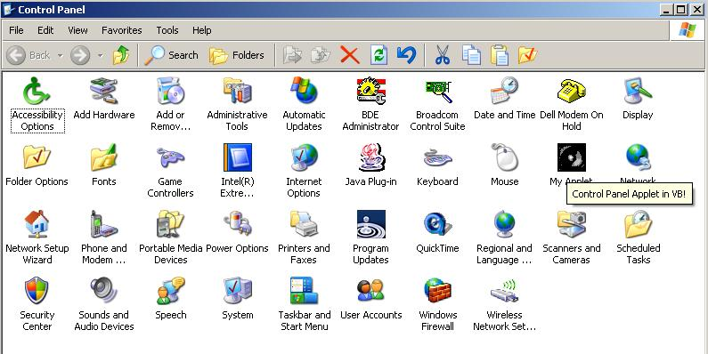



## Control Panel Applets in VB

### Description

You can create control panel applets in VB - with a little help. The first example is a generic .cpl file written in c++ which can be completely manipulated by editing its .ini file, adding as many applets as you wish. The second example is pure VB. The catch? You need to use the addin at : http://www.Planet-Source-Code.com/vb/scripts/ShowCode.asp?txtCodeId=54190&amp;lngWId=1 so you can compile it as a standard dll. Yet another example of how you can do almost anything with VB.
 
### More Info
 

             |
---                |---
**Submitted On**   |2006-06-03 08:29:42
**By**             |[jjprogrammer](https://github.com/Planet-Source-Code/PSCIndex/blob/master/ByAuthor/jjprogrammer.md)
**Level**          |Advanced
**User Rating**    |4.9 (34 globes from 7 users)
**Compatibility**  |VB 6\.0
**Category**       |[Windows System Services](https://github.com/Planet-Source-Code/PSCIndex/blob/master/ByCategory/windows-system-services__1-35.md)
**World**          |[Visual Basic](https://github.com/Planet-Source-Code/PSCIndex/blob/master/ByWorld/visual-basic.md)
**Archive File**   |[Control\_Pa199840632006\.zip](https://github.com/Planet-Source-Code/jjprogrammer-control-panel-applets-in-vb__1-65553/archive/master.zip)

